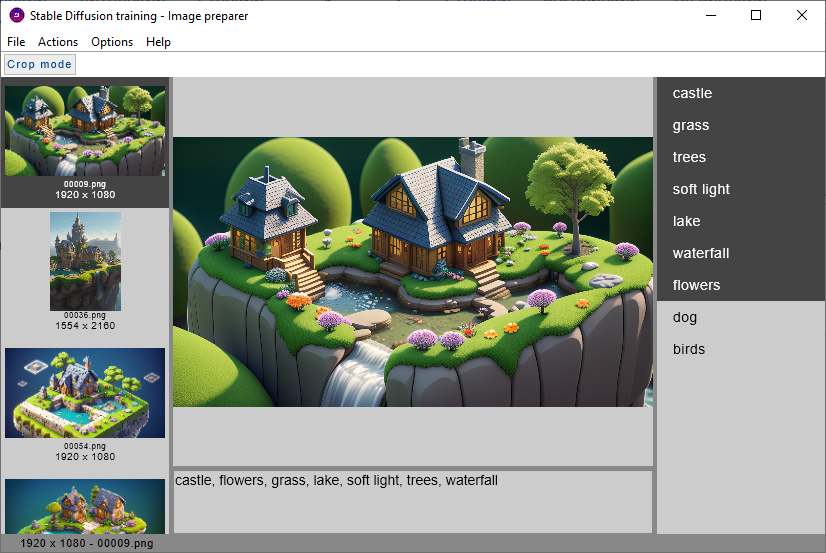
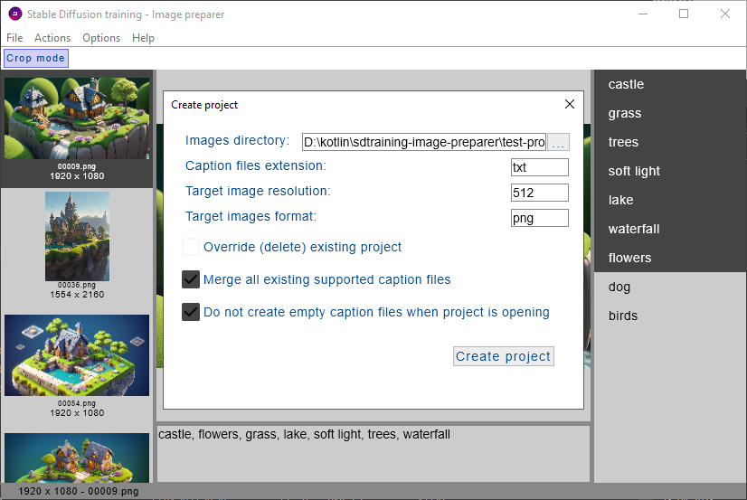

## Stable Diffusion training - Image preparer

The application is aimed to prepare images for training Stable Diffusion (using AUTOMATIC1111 interface)

**Early alfa version**

### Main window



### Current functionality

* Creating caption files for each image in the directory
* Adding/removing keywords from caption files by selecting them in list of keywords (right panel)
* Preparing keyword list analyzing exist captions files
* Cropping/resizing image so that it will be in specified size
* Deleting image

### Creating new project



### Used technologies and libraries

* Kotlin Compose
* [Chrynan Navigation](https://github.com/chRyNaN/navigation)
* [compose-multiplatform-file-picker](https://github.com/Wavesonics/compose-multiplatform-file-picker)
* [Koin Dependency Injection Framework](https://github.com/InsertKoinIO/koin)

### TODO list
* Button to close project
* Button to create/drop all caption files
* Convert image to another format
* Refresh images list from disc

### Compiling and running

Run project

```shell
gradlew.bat clean compileKotlin run
```

Run distributable

```shell
gradlew.bat clean compileKotlin runReleaseDistributable
```

Create distributable

```shell
gradlew.bat clean compileKotlin createDistributable
```

### Known bugs

* In crop mode right top and left bottom corners are resizing area incorrectly (proportional resize, without Shift)

### Useful links

* [compose-multiplatform-goes-alpha](https://blog.jetbrains.com/kotlin/2021/08/compose-multiplatform-goes-alpha/)
* [compose-multiplatform-tutorials](https://github.com/JetBrains/compose-multiplatform/tree/master/tutorials/)
* [compose-multiplatform-examples](https://github.com/JetBrains/compose-multiplatform#examples)


